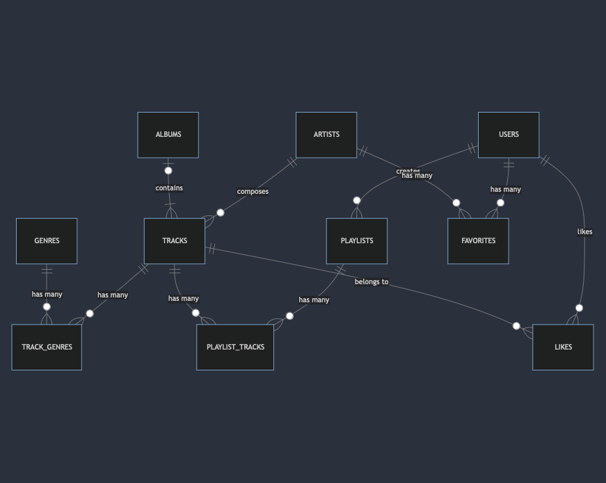

# Design Document

By Yusuke Ishida

Final Project submission for: [CS50 SQL](https://cs50.harvard.edu/sql/2024/)

## Scope

The database for a music database includes all entities necessary to represent artists with all their track and album releases with some accompanying information that allows for a user to find info about their favorite artists and songs. As such, include in the database scope is:

* Artists, including basic identifying information
* Users, including basic identifying information
* Albums which includes release date and title
* Tracks, including title, artist and album information
* Genres which includes all music genres
* Track_genres which represents the relationship between tracks and genres
* Playlists which represents playlists that a user has created which includes the name of a playlist
* Playlist_tracks which represents the relationship between users and playlists 
* Favorites which represents the favorited artists of a user
* Likes which represents the liked tracks of a user

Out of scope elements are streaming numbers, and other non-core attributes

## Functional Requirements

* CRUD operations for artists, tracks, and users
* Creating a playlist for a user with their favorite songs
* Finding information about an artists and their releases
* Finding information about a tracks
* Adding artists to user's favorites list
* Liking a song

## Representation

### Entities

#### Artists

The `artists` table includes:

* `id` which specifies the unique ID for the user as an `INTEGER`. This column has the `PRIMARY KEY` constraint applied.
* `name` which specifies the artist's name as `TEXT`.
* `started` which specifies when an artist's started their career. Timestamps in SQLite is represent by `NUMERIC`. The default value for the `started` column is the current date, as denoted by `CURRENT_DATE`. 

All columns are required hence the `NOT NULL` constraint on non-primary key tables.

#### Tracks
The `tracks` table includes:

* `id`, which specifies the unique ID for a track as an `INTEGER`. This column has the `PRIMARY KEY` constraint applied.
* `artist_id`,  which is the ID of the artist who performed the track. This column thus has the `FOREIGN KEY` constraint, referencing `id` column in the `artists` table to ensure data integrity.
* `album_id`, which is the ID of the album that the track belongs to. This column thus has the `FOREIGN KEY` constraint, referencing `id` column in the `albums` table to ensure data integrity.
* `title`, title of the track set as a `TEXT`.
* `date`, release data of the track represent by `NUMERIC`. The defalut value for the `date` column is the current date, as denoted by `CURRENT_DATE`. 
* `duration`, duration of a track in seconds represented by `NUMERIC`. 

All columns are required hence the `NOT NULL` constraint on non-primary and non-foreign key columns. No other constraint are required.

#### Track genres

Joint table for `tracks` and `genres`. The `track_genres` table includes:

* `id`, which specifies the unique ID for a track_genre as an `INTEGER`. This column has the `PRIMARY KEY` constraint applied.
* `track_id`, which is the ID of the track its referring to. This columns thus has the `FOREIGN KEY` constraint, referencing `id` column in the `tracks` table to ensure data integrity.
* `genre_id`, the ID of the genre its referring to. This columns thus has the `FOREIGN KEY` constraint, referencing `id` column in the `genres` table to ensure data integrity.

All columns are required.

#### Genres

The `genres` table includes:

* `id`, which specifies the unique ID for a genre as an `INTEGER`. This column has the `PRIMARY KEY` constraint applied.
* `name`, which is the name of the genre set as `TEXT`.

All columns are required hence the `NOT NULL` constraint on non-primary key column. No other constraint is required.

#### Albums

The `albums` table includes:

* `id`, which specifies the unique ID for an album as an `INTEGER`. This column has the `PRIMARY KEY` constraint applied.
* `title`, which is the title of the album set as `TEXT`.
* `date`, release data of the album represent by `NUMERIC`. The default value for the `date` column is the current date, as denoted by `CURRENT_DATE`.

All columns are required hence the `NOT NULL` constraint on non-primary key columns.

#### Users

The `users` table includes:

* `id`, which specifies the unique ID for user as an `INTEGER`. This column has the `PRIMARY KEY` constraint applied.
* `username`, which is the username of the user set as `TEXT`.
* `password`, which is the password of the user set as `TEXT`.
* `sign_up`, sign up date of the user represented by `NUMERIC`. The default value for the `sign_up` is when the sign up happened.

All columns are required hence the `NOT NULL` constraint on non-primary key columns. No other constraint is required.

#### Playlists

The `playlists` table includes:

* `id`, which specifies the unique ID for a playlist as an `INTEGER`. This column has the `PRIMARY KEY` constraint applied.
* `user_id`, which specifies the ID of the user who created the playlist as an `INTEGER`. This columns thus has the `FOREIGN KEY` constraint, referencing `id` column in the `users` table to ensure data integrity.
* `name`, which specifies the name of the created playlist.
* `created`, which is the timestamp when the playlist was created.

All columns are required hence the `NOT NULL` constraint on non-primary key columns. No other constraint is required.

#### Playlist_tracks

Joint table for `playlists` and `tracks`. The `playlist_tracks` table includes:

* `id`, which specifies the unique ID for a playlist.
* `track_id`, which specifies the tracks included in the playlist. This column this has the `FOREIGN KEY` constraint, referencing `id` column in the `tracks` table to ensure data integrity.
* `playlist_id`, which specifies the playlist that it belongs to. This column this has the `FOREIGN KEY` constraint, referencing `id` column in the `playlists` table to ensure data integrity.

#### Favorites

The `favorites` table includes:

* `id`, which specifies the unique IDfor a favorite as an `INTEGER`. Ths column has the `PRIMARY KEY` constraint applied.
* `artist_id`, which specifies the artists favorited by a user. This column this has the `FOREIGN KEY` constraint, referencing `id` column in the `artists` table to ensure data integrity.
* `user_id`, which specifies the user that favorited a song. This column this has the `FOREIGN KEY` constraint, referencing `id` column in the `users` table to ensure data integrity.

All column are required.

#### Likes

The `likes` table includes:

* `id`, which specifies the unique ID for a like as an `INTEGER`. Ths column has the `PRIMARY KEY` constraint applied.
* `user_id`, which specifies the user who liked a track. This column this has the `FOREIGN KEY` constraint, referencing `id` column in the `users` table to ensure data integrity.
* `track_id`, which specifies the track that liked by a user. This column this has the `FOREIGN KEY` constraint, referencing `id` column in the `tracks` table to ensure data integrity.

All columns are required.

### Relationships

The below entity relationship diagram describes the relationships among the entities in the database.

As detailed by the diagram:

* **One-to-many** relationship between Users and Playlists: One user can have multiple playlists.
* **One-to-many** relationship between Users and Favorites: One user can add many artists to their favorite list.
* **One-to-many** relationship between Users and Likes: One user can like multiple tracks.
* **One-to-many** relationship between Artists and Tracks: One artist can compose multiple tracks.
*  **One-to-many** relationship between Albums and Tracks: One album can contain multiple tracks.
*  **Many-to-many** relationship between Users and Artists: One user can add multiple artists to their favorite list and one artist can be be added by many users to their favorite list. The relationship is managed by Favorites table.
*  **Many-to-many** relationship between Users and Tracks: One user can like multiple tracks and one track can be liked by many user. The relationship is managed by Likes table.
*  **Many-to-many** relationship between Playlists and Tracks: One playlist can have multiple tracks and one track can be part of many playlists. The relationship is managed by Playlist_tracks table.
*  **Many-to-many** relationship between Genres and Tracks: One track can have multiple genres and one genre can be part of multiple tracks. The relationship is managed by Track_genres table.
*  **Many-to-many** relationship between Artists and Albums: One artist can have multiple albums and one album can have multiple artists. The relationship is managed by Tracks table.

## Optimizations

Per the queries written in `queries.sql`, it is common for users of the database to search for tracks that belongs to an artists or an album. Hence, indexes are created on the `name` of the artists and `title` of an album.

It is also common practice for a user of the database to concerned with viewing all tracks of a specific genre. For that reason, indexes to `name` of a `genre` was added.

## Limitations

* The current schema doesn't track the sales and streaming count of a song. 
* It also doesn't handle the creating a playlist with multiple users. To handle multiple creators of a playlist, it would require to shift to a many-to-many relationship between users and playlists.
* It also doesn't handle collaboration between artists. To handle collaboration of multiple artists would requrie to shift to a many-to-many relationship between artists and tracks.